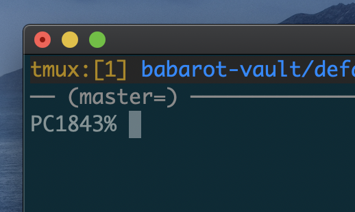

## tmux-git-prompt



### Installation

Use [tpm](https://github.com/tmux-plugins/tpm):

```tmux
set -g @plugin 'b4b4r07/tmux-git-prompt'
```

Write above line to your `~/.tmux.conf` and then type <kbd>prefix</kbd>+<kbd>I</kbd>.

### License

MIT